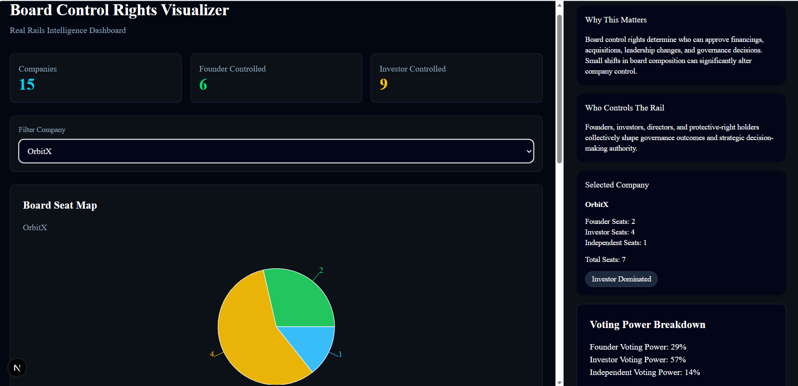

# Board Control Rights Visualizer



## Overview

Board Control Rights Visualizer is a governance intelligence dashboard designed to analyze how board composition, voting power, investor influence, protective rights, and governance structures affect decision-making within venture-backed companies.

Built as part of the Real Rails Intelligence Library under the **Capital Formation Rail**, the platform helps users understand how governance control shifts between founders, investors, and independent directors as organizations progress through different funding stages.

The dashboard transforms governance structures into interactive analytics, simulations, and visualizations that support governance analysis, board-control assessment, and strategic decision-making.

---

# Problem Statement

Ownership percentage alone does not determine control within venture-backed companies.

Board seats, voting rights, governance agreements, and protective provisions often have greater influence over strategic decisions such as:

* Raising new financing
* Budget approvals
* Acquisitions and mergers
* Board expansion
* Executive leadership changes

Understanding who truly controls a company can be difficult because governance information is often fragmented across legal agreements and disclosure documents.

Board Control Rights Visualizer provides a centralized governance intelligence layer that makes governance structures easier to understand, compare, and analyze.

---

# Objectives

The platform is designed to:

* Visualize board composition and governance control
* Analyze voting power distribution
* Identify governance concentration and majority control
* Compare founder and investor influence
* Simulate governance approval scenarios
* Track governance evolution across funding stages
* Highlight governance risks and alerts
* Provide governance intelligence and educational context
* Support governance-focused decision analysis

---

# Key Features

## Board Seat Map

Interactive visualization of:

* Founder Seats
* Investor Seats
* Independent Director Seats

---

## Voting Power Breakdown

Calculates voting influence percentages for:

* Founders
* Investors
* Independent Directors

---

## Board Majority Analysis

Determines:

* Total Board Seats
* Majority Threshold
* Governance Control Classification

---

## Founder vs Investor Control Meter

Calculates governance influence directly from board composition and visualizes:

* Founder Control Percentage
* Investor Control Percentage

---

## Governance Health Score

Evaluates governance quality using:

* Board balance
* Independent representation
* Governance concentration

---

## Decision Approval Simulator

Simulates governance outcomes for:

* Budget Approval
* New Financing
* Acquisition Approval
* Board Expansion

Features:

* Decision-specific voting thresholds
* Governance-right validation
* Supporting-group identification
* Approval and rejection outcomes

---

## Scenario Compare

Compares:

* Current Governance Structure
* Proposed Governance Structure

Highlights governance shifts and potential changes in control.

---

## Governance Timeline

Tracks governance progression through:

* Seed
* Series A
* Series B
* IPO

Timeline updates dynamically based on the selected company.

---

## Protective Rights Checklist

Displays governance protections including:

* Budget Approval Rights
* Financing Approval Rights
* Board Approval Rights
* Acquisition Approval Rights

---

## Governance Intelligence Sidebar

Provides governance context through:

* Why This Matters
* Who Controls The Rail
* Governance Intelligence
* Governance Impact
* Governance Alerts
* Governance Timeline
* Dataset Summary
* Source Context

---

## Governance Alerts

Automatically identifies:

* Founder Majority Situations
* Investor Majority Situations
* Protective Rights Requirements
* Independent Director Presence

Alerts update dynamically based on company governance structures.

---

## Data Source Status

Provides transparency regarding the governance data source:

* Governance Adapter Status
* Synthetic Fallback Status
* Data Processing Context

---

## Data Export

Supports:

* JSON Export
* CSV Export

Allowing governance records to be downloaded for further analysis.

---

# Data Sources

## Governance Adapter Layer

The backend implements a governance adapter layer that attempts governance data retrieval and automatically falls back to synthetic governance datasets when external governance feeds are unavailable.

---

## Reference Context

Governance concepts are inspired by:

* SEC EDGAR governance disclosures
* Venture financing governance structures
* Board-control frameworks used in capital formation

---

## Demonstration Dataset

This project uses synthetic governance datasets to simulate:

* Board compositions
* Governance structures
* Voting power distribution
* Protective rights
* Investor influence scenarios
* Governance-stage progression

Synthetic data is clearly labeled and used solely for demonstration and educational purposes.

---

# Dashboard Architecture

## Frontend

* Next.js
* TypeScript
* Tailwind CSS
* shadcn/ui
* Recharts

---

## Backend

* FastAPI
* Python
* requests

---

## Data Layer

* Governance Adapter Service
* SEC EDGAR Integration Stub
* Governance Metrics Service
* Synthetic Dataset Fallback Layer

---

## Architecture Flow

Governance Dataset

↓

Governance Adapter Layer

↓

FastAPI APIs

↓

Next.js Dashboard

↓

Governance Intelligence Visualizations

↓

User Analysis & Decision Support

---

# UI & Design

The dashboard follows Real Rails Intelligence design standards:

* Obsidian Background (#030712)
* Glassmorphism Cards
* Responsive Layout
* Governance Intelligence Sidebar
* Consistent Dark Theme
* Production Dashboard Structure

---

# Project Structure

```text
POC-84-Board-Control-Rights-Visualizer-Gopika
│
├── backend
├── frontend
├── screenshots
├── README.md
├── VAR_REPORT.md
├── UAT_CHECKLIST.md
└── .gitignore
```

---

# API Endpoints

## Metrics

```http
GET /api/metrics
```

Returns:

* Total Companies
* Founder Controlled Companies
* Investor Controlled Companies

---

## Companies

```http
GET /api/companies
```

Returns:

* Company Governance Records
* Board Composition Data
* Governance Stage Information
* Protective Rights Information

---

## Rights

```http
GET /api/rights
```

Returns governance-right definitions used throughout the dashboard.

---

# Local Setup

## Backend

```bash
cd backend

pip install -r requirements.txt

uvicorn app.main:app --reload
```

Backend runs at:

```text
http://localhost:8000
```

---

## Frontend

```bash
cd frontend

npm install

npm run dev
```

Frontend runs at:

```text
http://localhost:3000
```

---

# Validation

The repository includes:

* VAR_REPORT.md
* UAT_CHECKLIST.md

These documents validate:

* Dashboard functionality
* Governance analytics
* User acceptance testing
* Visualization quality
* Governance simulations
* Data-processing architecture

---

# Author

**Gopika T P**

**POC 84 – Board Control Rights Visualizer**

**Real Rails Intelligence Library – Capital Formation Rail**
